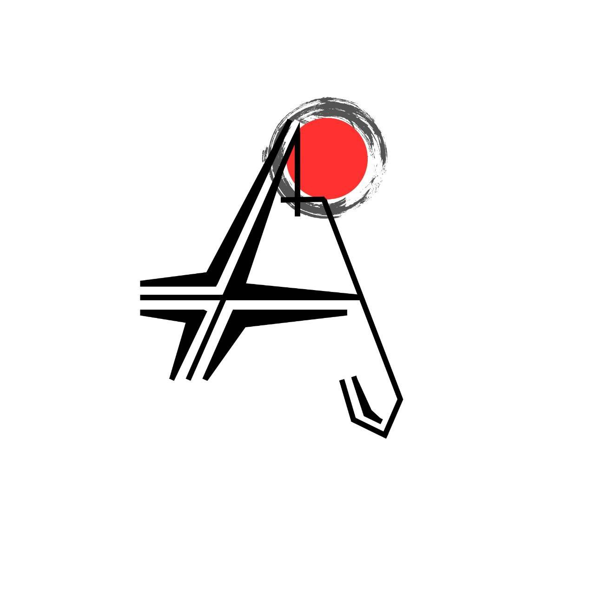
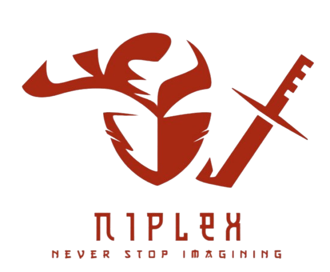

  

  

  

  

  

  

    
    
    
  

  <h1 class="hero-title">NEVER STOP IMAGINING</h1>

  

    Niplex is a technology company rooted in AI, Machine Learning, and code —
    committed to shifting the burden of heavy thinking to our systems so
    businesses can focus on human ingenuity.
  

  

    <a href="mission.html" class="md-button md-button--primary">Our Mission</a>
    <a href="projects/" class="md-button">Explore the Projects</a>
  

## Introduction

Welcome to **Niplex** — the open-source home of everything we build. This
documentation site is the public home for our projects, architecture, and the
roadmap behind everything we ship. Every project listed here is open source,
publicly inspectable, and built with a professional, long-term mindset.

## Company Mission

> At Niplex, our mission is clear: **"Never stop Imagining."**

In an era where technology is advancing exponentially, we believe that all a
human needs to do is think, imagine, and strategize. The rest of the heavy
lifting — processing data, managing files, automating workflows, and executing
repetitive tasks — can be left to Artificial Intelligence (AI).

As a technology, AI, Machine Learning (ML), and code-based company, Niplex is
dedicated to empowering non-technical users. We help individuals understand AI
and teach them how to leverage modern tools like Agentic Frameworks and Model
Context Protocol (MCP) connectors. Our goal is to shift the burden of "heavy
thinking" and "overthinking" to our systems — allowing businesses to focus on
what truly requires human ingenuity while AI handles tasks that take mere
minutes to automate but hours to do manually.

- :material-brain:{ .lg .middle } __Human Ingenuity__

    ---

    You think, imagine, and strategize — that's the part that stays human. Our
    systems handle the busywork around it.

- :material-cog:{ .lg .middle } __Automation__

    ---

    AI processes data, manages files, and automates workflows — minutes to
    automate, hours saved every single day.

- :material-link:{ .lg .middle } __Agentic Frameworks__

    ---

    Modern tools and MCP connectors make AI practical and secure for
    non-technical users and businesses alike.

- :material-open-source-initiative:{ .lg .middle } __Open Source__

    ---

    Everything here is public and inspectable. Private work stays private —
    this site only reflects what's out in the open.

## What you'll find here

- :material-rocket-launch:{ .lg .middle } __[Mission](mission.md)__

    ---

    The introduction and company mission of Niplex — why we build what we
    build.

- :material-eye-outline:{ .lg .middle } __[Vision](about.md)__

    ---

    Who we are, what we're building, and how we work.

- :material-folder-open:{ .lg .middle } __[Projects](projects/index.md)__

    ---

    The full, always-current list of every public repository we maintain.

- :material-map:{ .lg .middle } __[Roadmap](roadmap.md)__

    ---

    The path from a classroom in Gorakhpur to a robotics lab in Japan.

- :material-text-box-multiple:{ .lg .middle } __[Blog](blog/index.md)__

    ---

    Articles, tutorials, and progress updates straight from the Niplex team.

- :material-help-circle-outline:{ .lg .middle } __[FAQ](faq.md)__

    ---

    Quick answers about Niplex, our projects, and how to use them.

## The projects at a glance

| Project | Language | Status | Stars |
| ------- | -------- | ------ | ----- |
| [Rei-kun Bot](projects/rei-kun.md) | Python | Live & Operational | 1 |
| [Niplex-MCP](projects/niplex-mcp.md) | Python | Active Development | 0 |
| [Ishani v2](projects/ishani-v2.md) | LoRA / Python | Active Development | 1 |
| [Ishani (v1)](projects/ishani.md) | Jinja | Deprecated | 0 |
| [Neural-OS](projects/neural-os.md) | — | Early Design Phase | 0 |
| [AI Memory Workspace](projects/ai-memory-workspace.md) | — | Starter | 0 |

!!! note "Open source by default"

    Everything listed here is **public**. Private work stays private — this
    page only reflects what's out in the open.

## Get in touch

Find us on [GitHub](https://github.com/Aj-Niplex),
[LinkedIn](https://www.linkedin.com/in/aj-niplex-foundation), or reach out
directly at [niplex.owner@gmail.com](mailto:niplex.owner@gmail.com).
