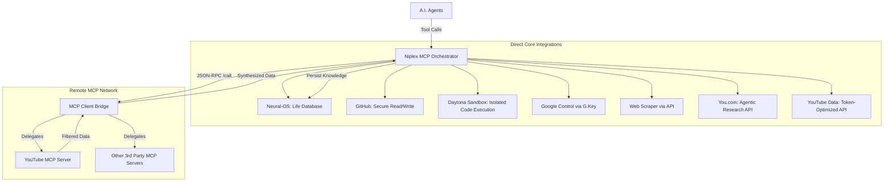

# Niplex-MCP

:octicons-repo-16: [Aj-Niplex/niplex-mcp](https://github.com/Aj-Niplex/niplex-mcp)

<span class="tag green">MCP</span> <span class="tag sakura">Security</span> <span class="tag sakura">AI Agents</span>

> Secure Model Context Protocol Server — a high-security bridge between AI
> tools and private infrastructure.

## Status

**Active Development.**

## The Secure Bridge

Niplex-MCP is a Model Context Protocol (MCP) server that acts as a
high-security bridge between AI tools (like Claude) and private
infrastructure. It eliminates the risk of **credential exposure** by handling
authentication on the server side.

## Architecture Flow



## How it Works

The server exposes specialized tools to the AI agent. When the agent calls a
tool, Niplex-MCP verifies the request, uses the stored server-side credentials
to interact with the target service, and returns only the necessary data to
the agent.

### Core Tools

- **GitHub Bridge** — securely list and read files from private repositories.
- **Daytona Sandbox** — spawn isolated environments to execute untrusted code.
- **Neural-OS** — query the internal life database for goals and profile
  context.
- **Web Intelligence** — high-fidelity web scraping via API.

## Configuration & Setup

To run Niplex-MCP, configure the following environment variables:

```bash
GITHUB_PAT=your_github_token
DAYTONA_API_KEY=your_daytona_token
NEURAL_OS_URL=http://your-neural-os-url:8000
SCRAPER_API_KEY=your_scraper_api_key
```

### Installation

```bash
pip install fastmcp requests daytona-sdk
python server.py
```

### Quick Start

```bash
git clone https://github.com/Aj-Niplex/niplex-mcp.git
cd niplex-mcp
python server.py
```

## Project Meta

- **Protocol:** MCP
- **Focus:** Security & Proxying
- **Language:** Python
- **Status:** Active Development

## Quick Links

- [View on GitHub](https://github.com/Aj-Niplex/niplex-mcp)
- [Read Documentation](https://github.com/Aj-Niplex/niplex-mcp/blob/main/README.md)
