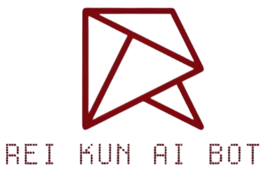

# Rei-kun Bot

{ align="right" width="140" }

:octicons-repo-16: [Aj-Niplex/Rei-kun-Bot](https://github.com/Aj-Niplex/Rei-kun-Bot) &nbsp;:octicons-star-16: 1 &nbsp;:octicons-tag-16: MIT

<span class="tag saffron">Discord</span> <span class="tag sakura">AI</span> <span class="tag sakura">Multi-Model</span>

> The Persona-Driven AI Orchestrator — a high-performance, AI-driven Discord
> orchestrator with a persistent persona, multi-model intelligence, and a
> comprehensive resource hub for students and devs.

## Status

**Live & Operational.** Running 24/7 for an active student community, managed
on a self-hosted Linux VPS.

## Core Architecture

Rei-kun uses a **multi-model fallback engine** via OpenRouter, switching
automatically between DeepSeek, LLaMA 4, GPT, and Gemini so a single model
outage doesn't take the bot down.

Key technical features:

- **Code Doctor** — a proprietary tool that scans Python source code, flags
  issues, and proposes patches with rollback support.
- **Resource Hub** — interactive wizard allowing students to retrieve notes,
  mind maps, and quizzes via code.
- **Dynamic Memory** — per-channel conversation memory for a persistent
  persona.
- **Hot-Reload** — architecture that allows module updates without restarting
  the bot.

## Deployment Specs

| Spec | Value |
| ---- | ----- |
| Host | Self-managed Linux VPS |
| RAM | 3 GB |
| CPU | 2-Core |
| Runtime | Python 3.13 |
| Libraries | discord.py, aiohttp, JSON storage |

## Quick Install

```bash
git clone https://github.com/Aj-Niplex/Rei-kun-Bot.git
cd Rei-kun-Bot
pip install -r requirements.txt
cp .env.example .env
python app.py
```

## Technical Meta

- **Commands:** 24 implemented
- **Modules:** 19 utility modules
- **Data:** 5 JSON-backed stores
- **License:** MIT

## Quick Links

- [Source Code](https://github.com/Aj-Niplex/Rei-kun-Bot)
- [Full README](https://raw.githubusercontent.com/Aj-Niplex/Rei-kun-Bot/main/README.md)
